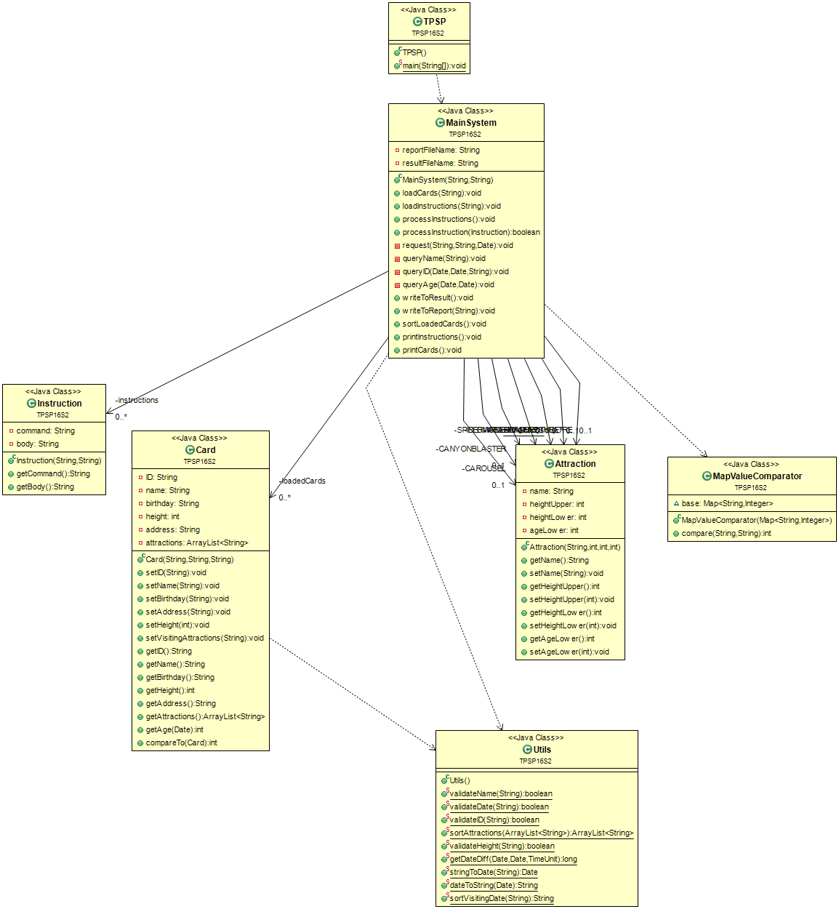

# TPSP16S2
This is the final project of COMP9103, the University of Sydney.

The software is called Theme Park Smart-Pass system(TPSP). It includes load cards from file, do modifications to and get information from the cards and write results/reports to output file.

